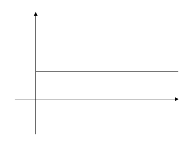
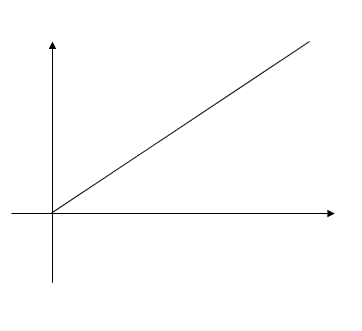
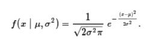
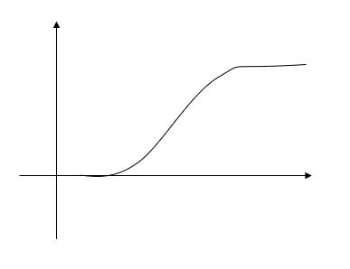
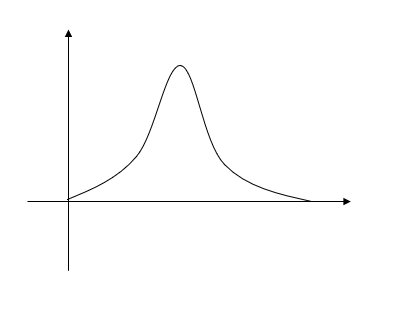

# school_3_1_Probability_and_Statistics

#### 1.Gaussian distribution of Random variable
[문제] : random number를 생성하는 함수를 이용하여 Gaussian 분포를 갖는 random variable을 생성하도록 변경

[전략] : 
1. random number를 생성하는 rand함수를 이용해 uniform한 분포를 가지는 난수들 생성

2. uniform한 확률밀도함수(pdf)를 누적분포함수(cdf)로 변환

3. 수식을 이용해 uniform한 누적분포함수(cdf)를 gaussian 형태의 누적분포함수(cdf)로 변환

4. 누적확률에 해당하는 z값을 찾기 위해 이진검색 기법을 활용해 gaussian 누적분포함수(cdf)의 역함수를 얻어냄

5. 얻어낸 역함수를 이용하여 gaussian 형태의 확률밀도함수(pdf)를 생성

#### 2.Histogram Equalization
